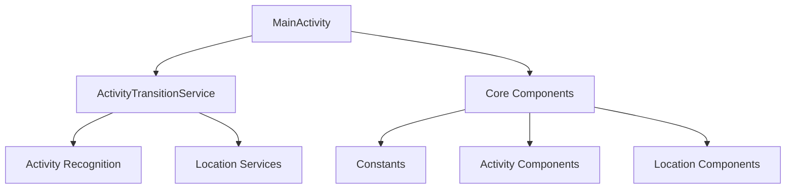

# Where Is It - Estructura del Proyecto Android

## Descripción General

Esta es una aplicación Android que utiliza Flutter como framework principal, con componentes nativos de Android para funcionalidades específicas como la detección de actividad y el seguimiento de ubicación.

## Estructura de Archivos

```
android/app/src/main/
├── AndroidManifest.xml
├── kotlin/
│   └── com/
│       └── example/
│           └── where_is_it/
│               ├── MainActivity.kt
│               ├── core/
│               │   ├── Constants.kt
│               │   ├── activity/
│               │   └── location/
│               └── service/
│                   └── ActivityTransitionService.kt
└── res/
```

## Componentes Principales

### 1. AndroidManifest.xml

El archivo de manifiesto define:

- Permisos necesarios:
  - Ubicación (FINE y COARSE)
  - Bluetooth
  - Servicios en primer plano
  - Reconocimiento de actividad
- Configuración de la aplicación
- Servicios registrados
- Receivers para eventos
- Meta-datos para plugins

### 2. MainActivity.kt

- Punto de entrada principal de la aplicación
- Maneja la integración entre Flutter y Android
- Gestiona el ciclo de vida de la aplicación

### 3. Servicios (service/)

#### ActivityTransitionService.kt

- Maneja las transiciones de actividad del usuario
- Implementa la lógica de detección de cambios de estado
- Se ejecuta como un servicio en primer plano

### 4. Core

#### Constants.kt

- Define constantes utilizadas en toda la aplicación
- Centraliza valores de configuración

#### Directorios Especializados:

- **activity/**: Componentes relacionados con la detección de actividad
- **location/**: Componentes para el manejo de ubicación

### 5. Detector de Estacionamiento (detector/)

El `ParkingDetector` gestiona la detección de estados de estacionamiento mediante el siguiente enum:

```kotlin
private enum class ParkingState {
    UNKNOWN,          // Estado inicial antes de cualquier detección
    DRIVING,          // El vehículo está en movimiento (velocidad > DRIVING_SPEED o evento ActivityTransition IN_VEHICLE)
    TENTATIVE_PARKED, // Tras conducir, se detecta una detención (velocidad < STOP_SPEED o actividad STILL)
    CONFIRMED_PARKED  // Después de TENTATIVE_PARKED, se confirma estacionamiento al detectar actividad de confirmación (caminar, bicicleta, etc.), ya sea por ActivityTransition o ActivityRecognition
}
```

**Descripción de estados:**

- **UNKNOWN**: Estado inicial antes de recibir datos de conducción o ubicación.
- **DRIVING**: Se activa cuando:
  - La velocidad (`Location.speed`) supera el umbral `Constants.DRIVING_SPEED`, o
  - Se detecta transición de actividad `IN_VEHICLE` (entrada al vehículo).
    Indica que el vehículo está siendo conducido activamente.
- **TENTATIVE_PARKED**: Se activa al pasar de `DRIVING` a una detención, detectada por:
  - Velocidad por debajo de `Constants.STOP_SPEED`, o
  - Evento de actividad `STILL`.
    Representa una parada provisional (por ejemplo, semáforos, atascos o inicio de estacionamiento).
- **CONFIRMED_PARKED**: Estado final que se aplica cuando, tras `TENTATIVE_PARKED`, se recibe una actividad de confirmación (caminar, bicicleta, etc.) mediante:
  - Evento de cambio de actividad (`ON_FOOT`, `WALKING`, `ON_BICYCLE`, etc.), o
  - Detección por polling de actividad con alta confianza.

Este modelo permite distinguir claramente entre conducción en curso, paradas temporales y estacionamiento confirmado.

## Diagrama de Dependencias



## Características Principales

1. **Seguimiento de Ubicación**

   - Ubicación en primer plano y segundo plano
   - Servicios de Google Play Location

2. **Detección de Actividad**

   - Reconocimiento de transiciones de actividad
   - Monitoreo de velocidad

3. **Servicios en Primer Plano**
   - Notificaciones persistentes
   - Monitoreo continuo

## Integración con Flutter

- La aplicación utiliza Flutter como framework principal
- Los componentes nativos de Android se integran a través de:
  - Method Channels
  - Event Channels
  - Platform Channels

## Permisos y Configuración

La aplicación requiere varios permisos para funcionar correctamente:

- `ACCESS_FINE_LOCATION`: Para ubicación precisa
- `ACCESS_COARSE_LOCATION`: Para ubicación aproximada
- `BLUETOOTH` y relacionados: Para funcionalidades Bluetooth
- `ACTIVITY_RECOGNITION`: Para detectar actividad del usuario
- `FOREGROUND_SERVICE`: Para servicios en primer plano

## Notas de Implementación

- La aplicación está configurada para Android 10+ (API level 29)
- Utiliza servicios en primer plano para funcionalidades críticas
- Implementa manejo de eventos a través de BroadcastReceivers
- Integra Google Maps para visualización de ubicación
